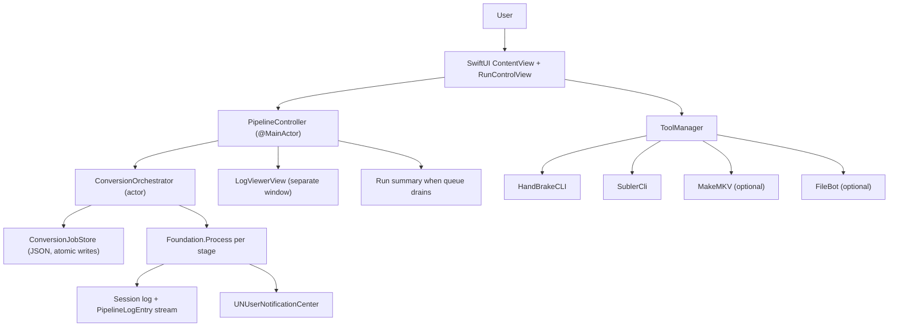
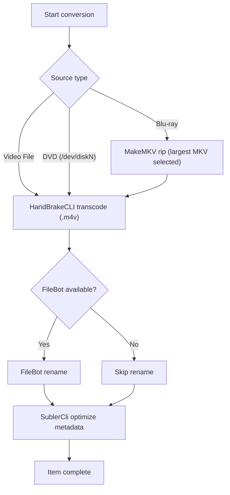
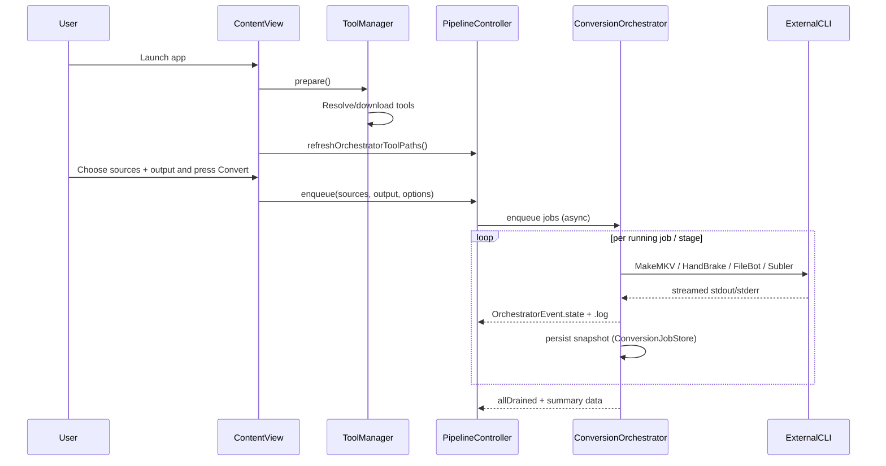
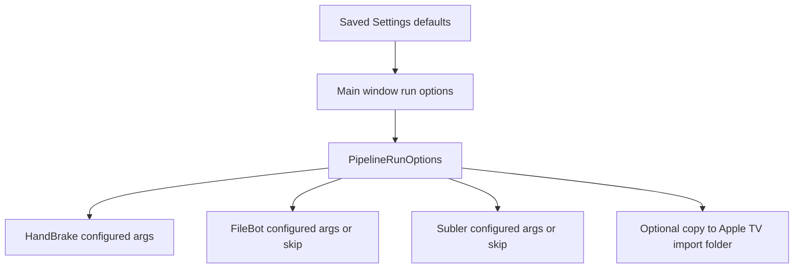
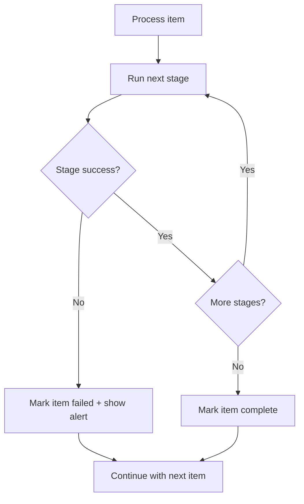
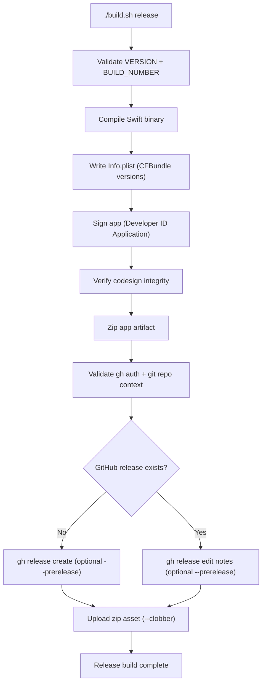

# Media-Magic

Media-Magic is a native macOS SwiftUI app (**Media Magic**) that orchestrates a
multi-stage conversion pipeline for movie/disc workflows:

- MakeMKV (Blu-ray only)
- HandBrakeCLI (transcode)
- FileBot (rename)
- SublerCli (metadata optimization)

The repository also includes a legacy shell + AppleScript pipeline as a
fallback path.

## Repository Layout

```text
Sources/MediaMagic/
  MediaMagicApp.swift
  ContentView.swift
  PipelineController.swift
  ConversionOrchestrator.swift
  ConversionJobStore.swift
  ConversionJobModels.swift
  ToolCheckpointAdapter.swift
  RunControlView.swift
  LogViewerView.swift
  ToolManager.swift
  … (additional Swift sources)
build.sh
MediaConversionPipeline.sh
LaunchMediaPipeline.applescript
docs/
  MEDIA_MAGIC_ORCHESTRATION.md   # deep-dive: lanes, persistence, diagrams
  BUILD_PROCESS.md
.github/workflows/
  media-magic.yml                 # compile-only CI on push/PR
```

## Architecture



Full diagrams (state machine, sequences, ER sketch): [docs/MEDIA_MAGIC_ORCHESTRATION.md](docs/MEDIA_MAGIC_ORCHESTRATION.md).

## End-To-End Pipeline Flow



## Tool Orchestration Sequence



## Settings And Run Overrides

The app now includes a Settings panel (`gear` button in header) with persistent
defaults, plus per-run overrides in the main Source card.

- Settings defaults (persisted in `UserDefaults`):
  - HandBrake preset + extra args
  - FileBot DB/format + extra args
  - Subler extra args
  - Default skip FileBot/Subler toggles
  - Default copy-to-Apple-TV auto-import toggle
  - Force first-run setup on next launch (re-download managed HandBrakeCLI)
- Main-window run options (override defaults for current run):
  - Skip FileBot
  - Skip Subler
  - Copy output to Apple TV auto-import folder:
    - `/Users/chris/Movies/TV/Media.localized/Automatically Add To TV.localized`



## Error Handling And Continuation



## Build And Run

Requirements:
- macOS 13+
- Xcode Command Line Tools (`xcode-select --install`)

Commands:

```bash
chmod +x build.sh
./build.sh
./build.sh release
# optional compatibility alias:
./build.sh release sign
open builds/<semver>+<build_number>/MediaMagic.app
```

## Build And Release Process

Release builds are now **signed-only GitHub distribution** builds:

- Build output is created under `builds/<VERSION>+<BUILD_NUMBER>/MediaMagic.app`
- App is signed with Developer ID Application identity
- App is zipped as `MediaMagic-<VERSION>+<BUILD_NUMBER>-macOS.zip`
- GitHub Release is created/updated for tag `<VERSION>+<BUILD_NUMBER>`
- Release asset is uploaded automatically (`gh release upload --clobber`)



Optional pre-release flag: `MEDIA_MAGIC_PRERELEASE=1 ./build.sh release` passes `--prerelease` to `gh` while keeping the tag as `<VERSION>+<BUILD_NUMBER>` (see `docs/BUILD_PROCESS.md`).

CI: `.github/workflows/media-magic.yml` runs a **compile-only** check on push/PR; it does not replace `./build.sh release`.

Distribution note:
- This mode is signed but **not notarized**.
- Some machines may still require first-open allowance (right-click Open), or:
  - `xattr -dr com.apple.quarantine MediaMagic.app`

Detailed build documentation: `docs/BUILD_PROCESS.md`

## Versioning And Build Numbering

Media-Magic uses [Semantic Versioning 2.0.0](https://semver.org):

- `VERSION` stores SemVer core: `MAJOR.MINOR.PATCH` (example: `0.1.0`).
- `BUILD_NUMBER` stores the last successful numeric build number.
- `build.sh` increments `BUILD_NUMBER` on each successful build.
- Each build writes immutable artifacts into:
  - `builds/<MAJOR.MINOR.PATCH>+<BUILD_NUMBER>/MediaMagic.app`

For Apple bundle metadata:

- `CFBundleShortVersionString` = contents of `VERSION`
- `CFBundleVersion` = incremented numeric `BUILD_NUMBER`

Release cadence guidance:

- Alpha stage baseline:
  - Start at `0.1.0`.
  - Keep major version `0` until explicitly moving beyond Alpha.
- Increment `PATCH` for backward-compatible bug fixes.
- Increment `MINOR` for backward-compatible feature additions.
- Increment `MAJOR` for backward-incompatible changes.
- Do not modify artifacts of an existing build ID; create a new build instead.
- Every successful `release` build must upload its zipped artifact to GitHub
  Releases for the matching build tag.

## Tool Resolution Model

- `HandBrakeCLI`:
  - Uses existing system install if present.
  - Otherwise downloads pinned release DMG and installs binary into
    `~/Library/Application Support/MediaMagic/bin/`.
- `SublerCli`:
  - Resolved from common paths; if missing, app prompts install guidance.
- `MakeMKV`:
  - Required only for Blu-ray.
- `FileBot`:
  - Optional; rename stage is skipped if absent.

## CLI Stage Commands

| Stage | Command pattern |
|---|---|
| MakeMKV | `makemkvcon -r --minlength=3600 --progress=-stderr mkv disc:0 all <folder>` |
| HandBrakeCLI | `HandBrakeCLI -i <src> -o <out>.m4v --preset-import-gui --preset "Apple 2160p60 4K HEVC Surround" -v 1` |
| FileBot | `filebot -rename <file> --db TheMovieDB --format "{n} ({y})" -non-strict --action move --conflict auto` |
| SublerCli | `SublerCli -source <file> -optimize` |

## Logs And Outputs

- A run log is written to output directory:
  - `conversion_log_YYYY-MM-DD_HH-MM-SS.txt`
- The UI summary reports:
  - total items
  - succeeded/failed items
  - elapsed times
  - log file location

## Legacy Pipeline

Legacy scripts remain available:
- `MediaConversionPipeline.sh`
- `LaunchMediaPipeline.applescript`

Use this path if you prefer shell-driven dialogs or need to run without the
SwiftUI app.
