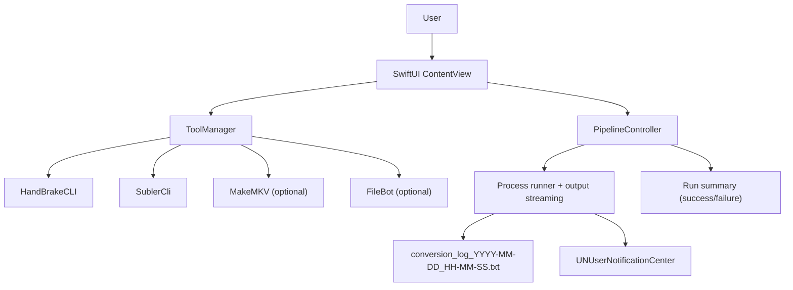
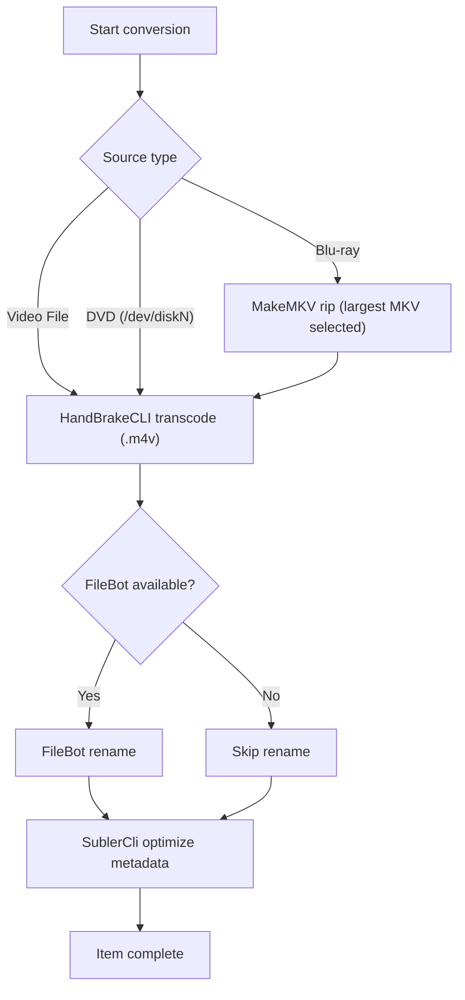
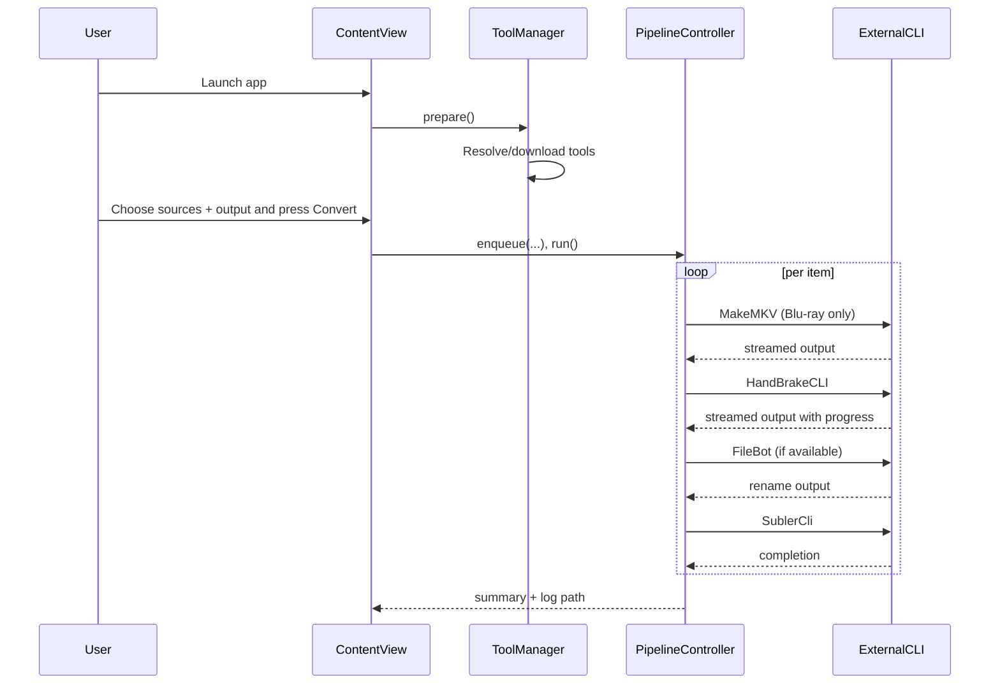
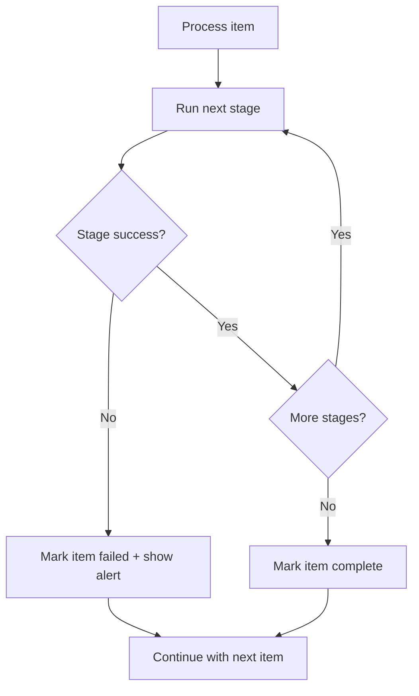

# Media-Magic

Media-Magic is a native macOS SwiftUI app (`MediaVault`) that orchestrates a
multi-stage conversion pipeline for movie/disc workflows:

- MakeMKV (Blu-ray only)
- HandBrakeCLI (transcode)
- FileBot (rename)
- SublerCli (metadata optimization)

The repository also includes a legacy shell + AppleScript pipeline as a
fallback path.

## Repository Layout

```text
Sources/MediaVault/
  MediaVaultApp.swift
  ContentView.swift
  PipelineController.swift
  ToolManager.swift
build.sh
MediaConversionPipeline.sh
LaunchMediaPipeline.applescript
```

## Architecture



## End-To-End Pipeline Flow



## Tool Orchestration Sequence



## Error Handling And Continuation



## Build And Run

Requirements:
- macOS 13+
- Xcode Command Line Tools (`xcode-select --install`)

Commands:

```bash
chmod +x build.sh
./build.sh
./build.sh release
./build.sh release sign
open build/MediaVault.app
```

## Tool Resolution Model

- `HandBrakeCLI`:
  - Uses existing system install if present.
  - Otherwise downloads pinned release DMG and installs binary into
    `~/Library/Application Support/MediaVault/bin/`.
- `SublerCli`:
  - Resolved from common paths; if missing, app prompts install guidance.
- `MakeMKV`:
  - Required only for Blu-ray.
- `FileBot`:
  - Optional; rename stage is skipped if absent.

## CLI Stage Commands

| Stage | Command pattern |
|---|---|
| MakeMKV | `makemkvcon -r --minlength=3600 --progress=-stderr mkv disc:0 all <folder>` |
| HandBrakeCLI | `HandBrakeCLI -i <src> -o <out>.m4v --preset-import-gui --preset "Apple 2160p60 4K HEVC Surround" -v 1` |
| FileBot | `filebot -rename <file> --db TheMovieDB --format "{n} ({y})" -non-strict --action move --conflict auto` |
| SublerCli | `SublerCli -source <file> -optimize` |

## Logs And Outputs

- A run log is written to output directory:
  - `conversion_log_YYYY-MM-DD_HH-MM-SS.txt`
- The UI summary reports:
  - total items
  - succeeded/failed items
  - elapsed times
  - log file location

## Legacy Pipeline

Legacy scripts remain available:
- `MediaConversionPipeline.sh`
- `LaunchMediaPipeline.applescript`

Use this path if you prefer shell-driven dialogs or need to run without the
SwiftUI app.
