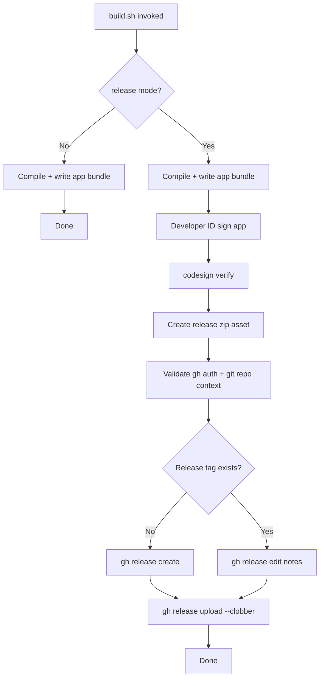
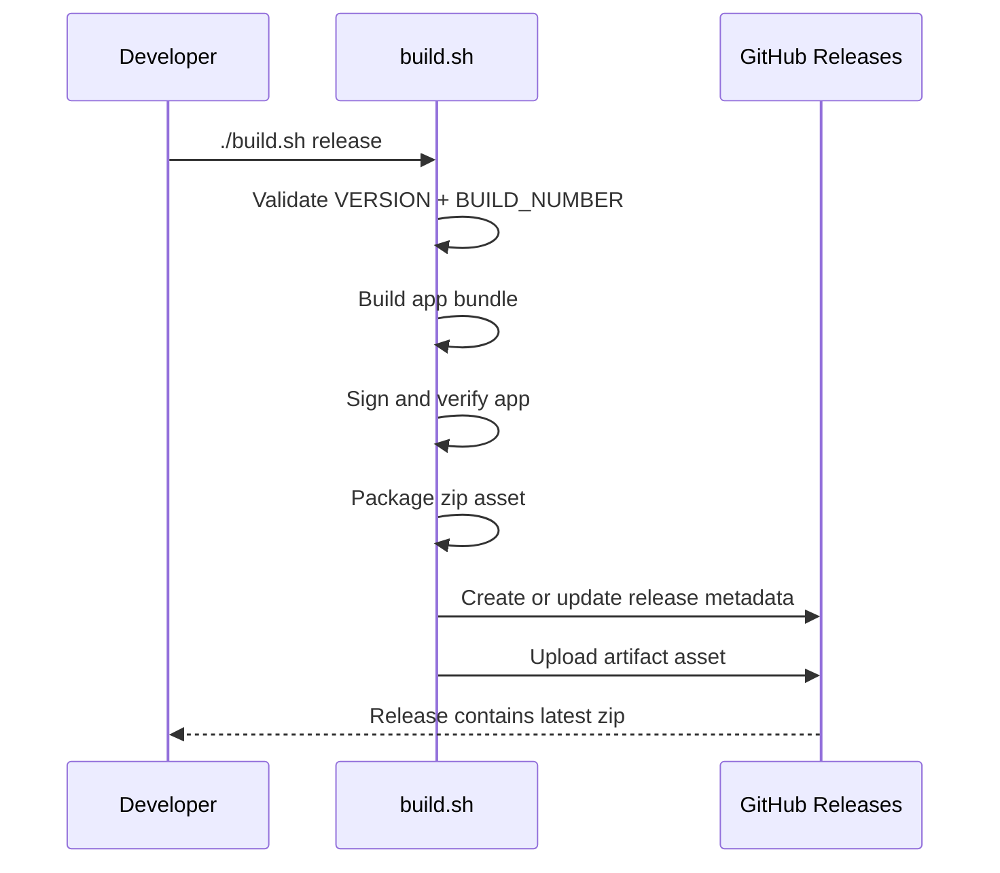
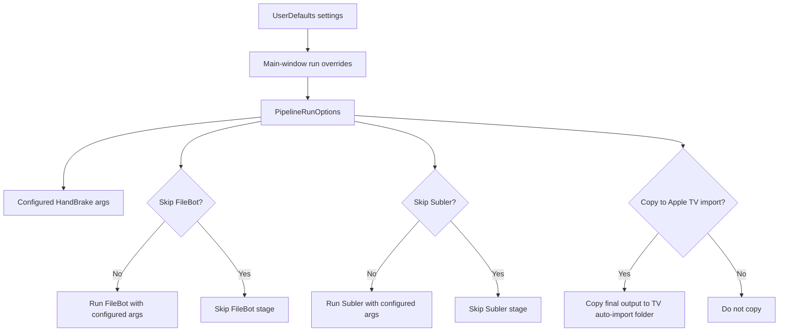

# Build Process Documentation

This document describes the current build pipeline implemented by `build.sh`.

## Modes

- `./build.sh`:
  - Debug/local build only.
- `./build.sh release`:
  - Production-oriented build with signed-only GitHub distribution flow.
- `./build.sh release sign`:
  - Compatibility alias; same release behavior.

## Version Inputs

- `VERSION`:
  - SemVer core (`MAJOR.MINOR.PATCH`), currently Alpha baseline (`0.1.0`).
- `BUILD_NUMBER`:
  - Numeric counter incremented after each successful build.

Build ID format:
- `<VERSION>+<BUILD_NUMBER>`
- Example: `0.1.0+7`

## Build Artifact Layout

For each successful build:

- App bundle:
  - `builds/<BUILD_ID>/MediaVault.app`
- Release zip:
  - `builds/<BUILD_ID>/MediaVault-<BUILD_ID>-macOS.zip`

## End-To-End Build Flow



## CI/CD-Style Release Actions (Local Script)



## Signing/Distribution Policy

- Distribution mode is **signed-only** (Developer ID).
- Notarization is intentionally out-of-scope at the moment.
- Users may need first-launch Gatekeeper bypass on downloaded artifacts:
  - Right-click app -> Open
  - Or remove quarantine:
    - `xattr -dr com.apple.quarantine MediaVault.app`

### Developer ID identity not found

`security find-identity -v -p codesigning` only lists identities that have a **private key** in your keychain. Importing Apple’s **`developerID_application.cer`** alone adds the public certificate only — **`codesign` will not list a usable identity for it**.

**Apple Development** (e.g. `Apple Development: Your Name (TEAMID)`) is for Xcode / personal-team signing. It is **not** a substitute for **Developer ID Application**, which `./build.sh release` requires for distributable macOS binaries outside the Mac App Store.

Fix:

1. Install the certificate **with private key** (e.g. **`.p12`** exported from the Mac that created the CSR, or from Keychain on that machine: *My Certificates* → right‑click → Export).
2. Double‑click the `.p12` in Keychain Access (login keychain), enter password.
3. Confirm:

```bash
security find-identity -v -p codesigning | grep 'Developer ID Application'
```

4. Run `./build.sh release` again. The script matches `DEVELOPER_ID_APPLICATION` or falls back to `DEVELOPER_ID_TEAM` (default `PM529U3B66`). If the name is awkward, set **`DEVELOPER_ID_SIGNING_HASH`** to the **40‑character hex** token shown before the quoted name on that line.

## Release Notes Automation

Release notes are generated by script and include:
- version/build identifiers
- artifact filename
- signed/not-notarized distribution note
- Gatekeeper workaround guidance

## GitHub “Pre-release” toggle (semver channel)

GitHub supports marking a release as **Pre-release** without renaming the tag.

- **Tag format (unchanged):** `<VERSION>+<BUILD_NUMBER>` (example: `0.1.0+21`).
- **Command:**

```bash
MEDIAVAULT_PRERELEASE=1 ./build.sh release
```

This passes `--prerelease` to `gh release create` / `gh release edit` and appends a short note to the generated release body.

If you additionally want a *separate* SemVer pre-release **tag** (for example `v0.1.0-beta.1`) pointing at the same commit, create it manually after the release build:

```bash
git tag -a v0.1.0-beta.1 -m "Pre-release channel marker" <commit-sha>
git push origin v0.1.0-beta.1
```

That tag is **not** wired into `build.sh` today; the downloadable asset remains attached to `<VERSION>+<BUILD_NUMBER>`.

## CI: compile check (GitHub Actions)

The workflow `.github/workflows/mediavault.yml` runs on `push` and `pull_request` to `main` and compiles all `Sources/MediaVault/*.swift` with the same macOS deployment target as `build.sh`.

It does **not** run `./build.sh` because that increments `BUILD_NUMBER` and clones FileBot scripts. Full signed releases remain a **maintainer-local** `./build.sh release` (requires Developer ID + `gh` auth).

## Runtime Settings Impact

Application Settings and per-run toggles affect conversion command lines and
post-processing behavior (separate from build/release pipeline):


