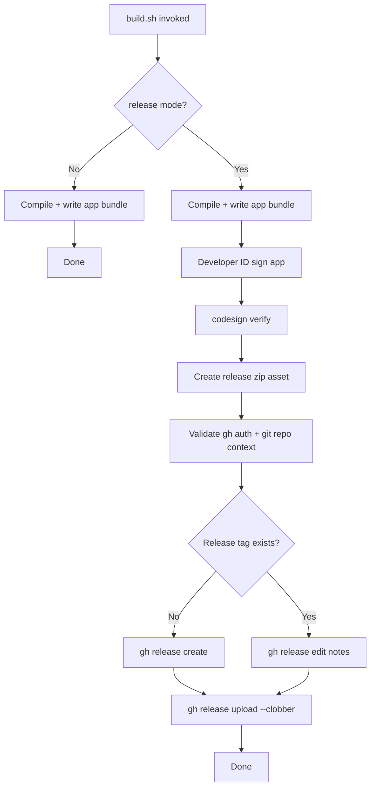
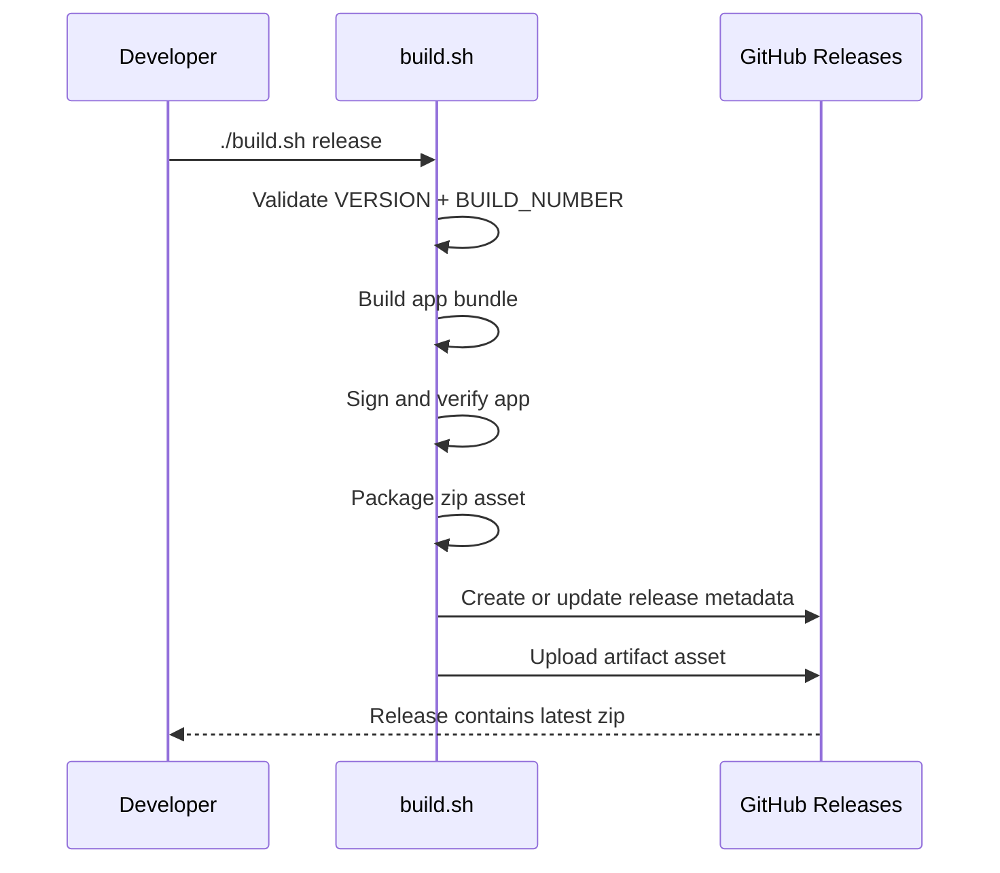
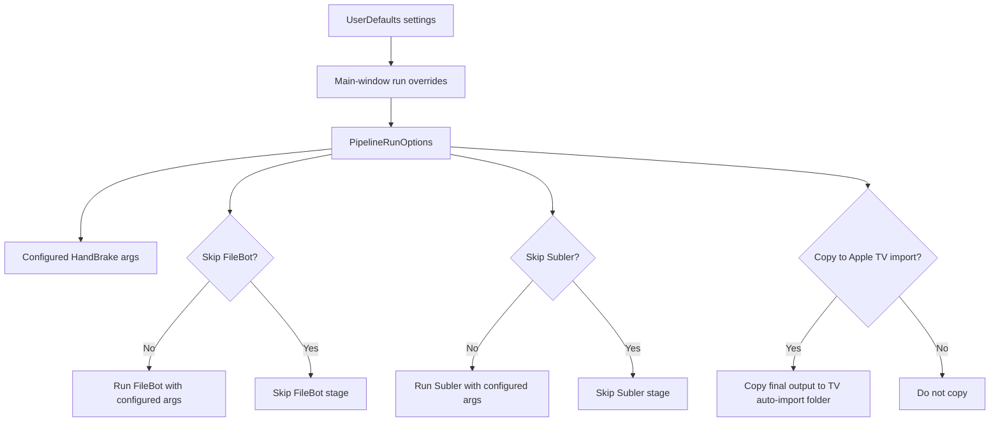

# Build Process Documentation

This document describes the current build pipeline implemented by `build.sh`.

## Modes

- `./build.sh`:
  - Debug/local build only.
- `./build.sh release`:
  - Production-oriented build with signed-only GitHub distribution flow.
- `./build.sh release sign`:
  - Compatibility alias; same release behavior.

## Version Inputs

- `VERSION`:
  - SemVer core (`MAJOR.MINOR.PATCH`), currently Alpha baseline (`0.1.0`).
- `BUILD_NUMBER`:
  - Numeric counter incremented after each successful build.

Build ID format:
- `<VERSION>+<BUILD_NUMBER>`
- Example: `0.1.0+7`

## Build Artifact Layout

For each successful build:

- App bundle:
  - `builds/<BUILD_ID>/MediaVault.app`
- Release zip:
  - `builds/<BUILD_ID>/MediaVault-<BUILD_ID>-macOS.zip`

## End-To-End Build Flow

## CI/CD-Style Release Actions (Local Script)

## Signing/Distribution Policy

- Distribution mode is **signed-only** (Developer ID).
- Notarization is intentionally out-of-scope at the moment.
- Users may need first-launch Gatekeeper bypass on downloaded artifacts:
  - Right-click app -> Open
  - Or remove quarantine:
    - `xattr -dr com.apple.quarantine MediaVault.app`

## Release Notes Automation

Release notes are generated by script and include:
- version/build identifiers
- artifact filename
- signed/not-notarized distribution note
- Gatekeeper workaround guidance

## Runtime Settings Impact

Application Settings and per-run toggles affect conversion command lines and
post-processing behavior (separate from build/release pipeline):

