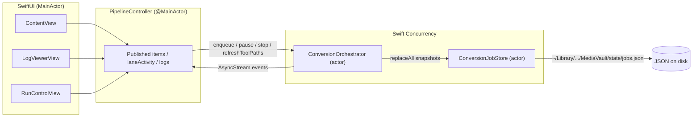
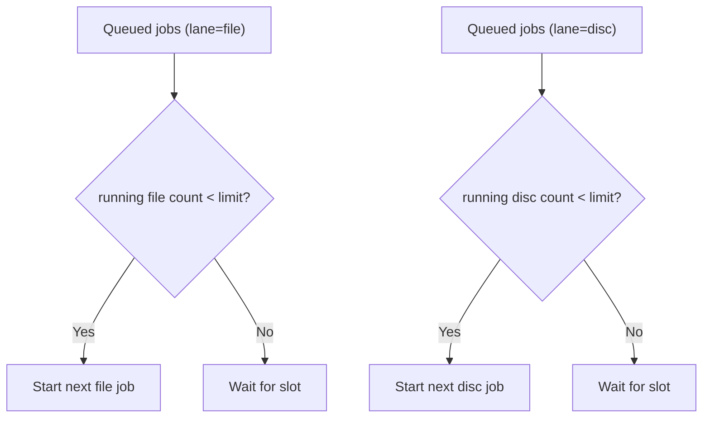
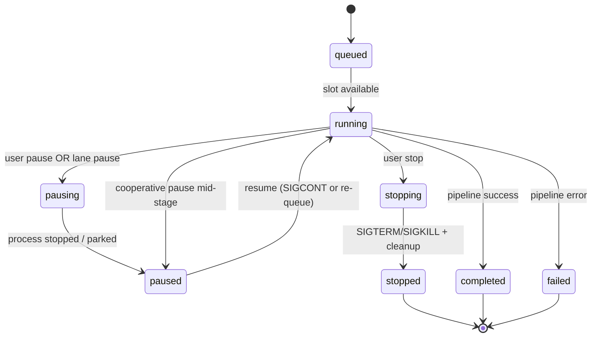
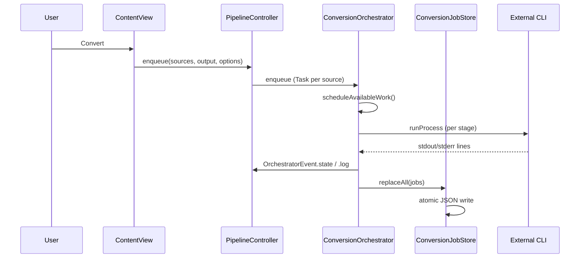
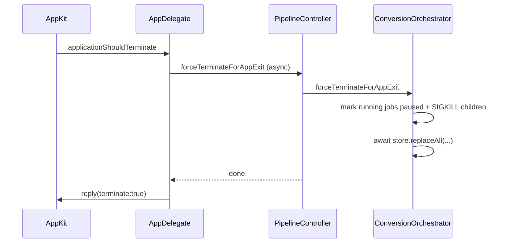
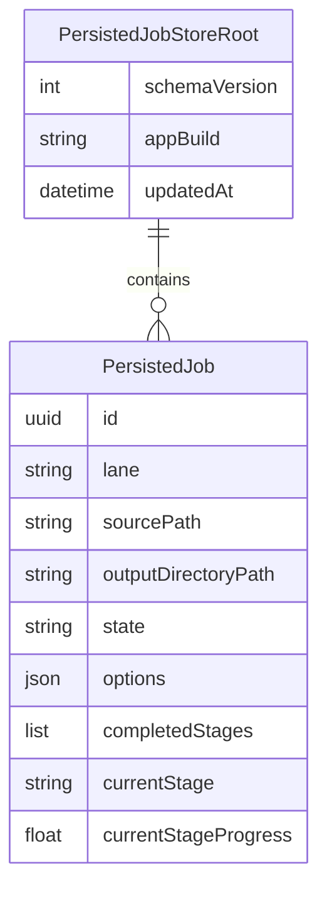

# MediaVault orchestration, persistence, and controls

This document describes the **current** MediaVault architecture after the job-orchestration redesign. It is derived from the Swift sources under `Sources/MediaVault/`.

## Goals (what shipped)

- **Concurrent lanes**: file-based jobs and disc-based jobs schedule independently with per-lane concurrency limits.
- **Global / lane / job controls**: pause, resume, and stop at each scope; stop uses a confirmation dialog in the UI.
- **Durable job state**: jobs are persisted so the app can reconstruct paused work after relaunch (with the limitations documented below).
- **Live log UI**: separate “Process Log” window with filters and search.
- **Tool path materialization**: discovered `SublerCli` is copied into Application Support and quarantine is stripped (same pattern as managed HandBrakeCLI).

## Repository layout (Swift app)

```text
Sources/MediaVault/
  MediaVaultApp.swift          # App entry, recovery task, terminate hook
  ContentView.swift            # Lane-aware queue + run controls
  PipelineController.swift   # MainActor facade + log projection
  ConversionOrchestrator.swift  # actor: scheduling, Process I/O, persistence fan-out
  ConversionJobStore.swift     # actor: JSON atomic store under Application Support
  ConversionJobModels.swift    # Codable persisted shapes + schema version
  ToolCheckpointAdapter.swift  # Stage capability matrix (pause/resume semantics)
  ToolManager.swift            # CLI discovery / download
  RunControlView.swift         # Pause / Stop UI cluster (global, lane, job)
  LogViewerView.swift          # Process log window
  … (other existing Swift files)
```

## High-level architecture



## Lane scheduling

Default limits are defined where `PipelineController` constructs `ConversionOrchestrator` (see `MediaVaultApp.init` / `PipelineController.init`): **file lane = 2** concurrent workers, **disc lane = 1** (optical drive is typically the bottleneck).



## Job lifecycle (orchestrator)

`ManagedJob.state` drives the UI badges. Persisted records map terminal/transient states to `PersistedJobState` for disk snapshots.



## Sequence: enqueue → run → persist



## Sequence: graceful app termination

`NSApplicationDelegate.applicationShouldTerminate` returns `.terminateLater` while the pipeline asks the orchestrator to flush state and kill children. See `MediaVaultApp.swift` / `AppDelegate`.



## Persistence model (JSON, not SQLite)

The attached historical plan mentioned SQLite; the **implemented** store is a versioned JSON document:

- Path: `~/Library/Application Support/MediaVault/state/jobs.json`
- Writer: `ConversionJobStore` uses `Data.write(..., .atomic)` for crash-safe replacement.
- Decoder uses **ISO-8601** dates to match the encoder (required for round-trip).



### Corruption and version mismatch

- **Parse failure / unreadable JSON**: file is moved aside to `jobs.json.corrupt-<timestamp>-<reason>`; UI receives `ConversionJobStoreLoadOutcome.quarantined`.
- **Unknown `schemaVersion`**: same quarantine path; user-facing recovery alert via `PipelineController.recoveryAlert`.

## Pause / resume / stop semantics (verified constraints)

Authoritative commentary lives in `ToolCheckpointAdapter.swift`. Summary:

- **In-session pause** uses `Process.suspend()` / `resume()` (documented as SIGSTOP/SIGCONT). Stopped processes cannot rely on PIDs after app exit.
- **HandBrake / MakeMKV** do not expose portable mid-encode checkpoint files in this integration; resuming after relaunch may **restart the active stage** from the beginning.
- **FileBot / Subler** stages are treated as **idempotent** re-runs where safe.

## Process log

- `PipelineController` appends structured `PipelineLogEntry` rows for the main window stream.
- `LogViewerView` filters by process tag and substring search.

## Optional semver “pre-release” label vs build tags

Project policy (`.cursor/rules` and `build.sh`) uses GitHub release tags of the form **`0.1.0+<BUILD_NUMBER>`**, not `v1.2.0-beta.1`.

To mark a GitHub Release as **Pre-release** while keeping that tag format, run:

```bash
MEDIAVAULT_PRERELEASE=1 ./build.sh release
```

See `docs/BUILD_PROCESS.md` for details.
